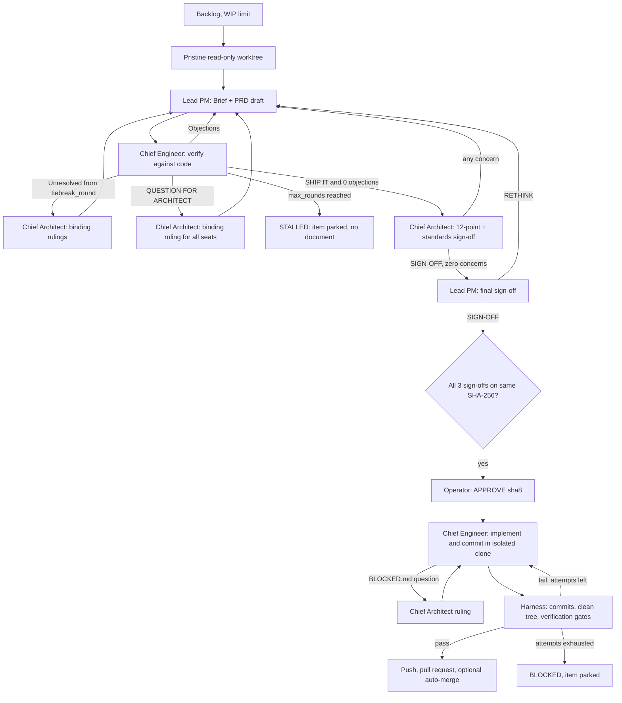

<div align="center">

# 🏛️ Open Councilmen

### *Three AI CLIs argue over a spec until they agree. You approve it. Then it ships.*

[](https://github.com/goshtasb/OpenCouncilmen/actions)
[](https://opensource.org/licenses/MIT)
[](https://nodejs.org/)

[Quickstart](#-quickstart) •
[How it works](#-how-it-works) •
[The Council Positions](#-the-council-positions) •
[Providers](#-providers) •
[Honest limits](#-honest-limits) •
[Contributing](CONTRIBUTING.md)



<sub>A real session, replayed from its transcript.</sub>

</div>

## 🏛️ It wrote a feature for its own repository

The council was pointed at this codebase and asked for a small feature.

**Gemini** drafted a PRD. **Claude** read the actual source and came back with six objections citing `file:line` — including one that caught a mistake in **Grok**'s own ruling. Four rounds later Claude ratified it with zero objections, Grok signed off against a 12-point standards checklist with zero concerns, Gemini gave the final sign-off, and only then did a PDF land for a human to approve.

After approval Claude implemented it in an isolated clone, the harness ran the project's gates, and [PR #1](https://github.com/goshtasb/OpenCouncilmen/pull/1) opened by itself.

Then CI failed the PR. The branch compiled, `main` compiled, the merge did not. The harness had verified the branch in isolation while GitHub verifies the merge — so it now merges your base branch *before* running its gates, and the feature the council wrote (`councilmen gates`) shipped in [v0.1.0](https://github.com/goshtasb/OpenCouncilmen/releases/tag/v0.1.0) alongside the fix.

That is the whole idea: **the disagreement is the product.** A single agent that agrees with you produces plausible code. Three agents with different jobs, one of which cannot write code at all, produce a specification someone can actually approve.

---

## 💡 How it works

One decision reaches you: approve the PRD, or don't. Nothing is written before that.

| Seat | Runs as | Job | Cannot |
| :--- | :--- | :--- | :--- |
| **Lead PM** (*Synapse*) | Gemini via Antigravity | Researches the repo, writes and revises the Brief + PRD, signs off last | Edit code |
| **Chief Engineer** | Claude Code | Verifies every claim against the code, objects with `file:line`, implements after approval | Ratify what it cannot test |
| **Chief Architect** | Grok | Breaks deadlocks, rules on undefined rules, audits against 12 standards | See your repository at all |
| **You** | Human | Approve the finished PRD | Be interrupted for anything else |

A document reaches you only when all three have signed off **the byte-identical file**: the Engineer with zero objections, the Architect with zero concerns, the Lead last. `finalize` and `approve` both re-check that against its SHA-256. After your approval the Chief Engineer works in a throwaway clone, the harness merges your base branch, runs your verification gates, and pushes only if they pass. Anything that fails is reported as `BLOCKED` — never as done.

```bash
npm install -g github:goshtasb/OpenCouncilmen   # ~5s; builds on install, no npm account needed
councilmen init && councilmen doctor
```

---

## ⚠️ Honest limits

- A full council takes roughly **10–40 minutes** and spends real subscription quota.
- Live runs so far are single digits. **One in five stalled** without producing a document — by design, but it means you paid for nothing.
- macOS and Linux only; gates run through a POSIX shell. CI covers Node 18/20/22 on Ubuntu and macOS.
- `gemini-cli` is unusable on current individual Gemini tiers — use the Antigravity CLI (`agy`) for Gemini seats.
- The Ollama adapter is implemented but has **never been run** ([#2](https://github.com/goshtasb/OpenCouncilmen/issues/2)).
- Neither Antigravity nor `gemini-cli` can be stripped of tools, so neither may hold the zero-tool Architect seat. `councilmen doctor` warns you.

Found one of these the hard way? [Tell us](https://github.com/goshtasb/OpenCouncilmen/issues/new/choose) — a council that went wrong is the most useful bug report this project can get.

---

## ⚡ Key Features

* **Adversarial Deliberation**: Multi-round debate between PM and Engineer until the Engineer ratifies (`SHIP IT` + 0 open objections).
* **Binding Arbitration**: From `tiebreak_round` on, every unresolved round is arbitrated by the Chief Architect; if `max_rounds` passes without unanimous sign-off the session stops as `STALLED` and nothing is presented to you.
* **No Human in the Loop**: Any seat that needs a rule the standards don't define writes `QUESTION FOR ARCHITECT: …`; the Chief Architect's ruling binds every seat. This applies during execution too.
* **Unanimous, Zero-Concern, Hash-Bound Sign-Off**: The Operator only sees a PRD that the Chief Engineer ratified (0 objections), the Chief Architect signed off with zero REQUIRED and zero ADVISORY concerns, and the Council Lead signed off — all on the same SHA-256. Finalization and approval both re-check this.
* **12-Point Industry Standards Review**: Every specification is audited against named current practice — SOC 2/ISO 27001 change management, OWASP ASVS + NIST SSDF secure development, SLSA/SBOM supply chain, test-pyramid and release engineering, GDPR/DPIA data governance, ISO 42010 ADRs and ISO 29148 requirement quality, SRE SLOs with OpenTelemetry, progressive delivery and expand-contract migrations, WCAG 2.2 AA and ICU i18n, SemVer/OpenAPI/RFC 9457 contracts, p95 and cost budgets, and OWASP LLM Top 10 for AI components.
* **Engineering Standards**: `.councilmen/standards/` — 00 Manifest, 01 Architecture, 02 Coding Practices, 03 Documentation — is given to every seat; seats cite rules by number, name and section.
* **Subscription-First (Zero API Token Burn)**: Drives the CLIs you already pay for (Claude Code, Grok, Antigravity/Gemini) or local Ollama.
* **Verified Hands-Off Execution**: The Chief Engineer commits on `council/<slug>` in an isolated clone. Blockers go to the Chief Architect and failed checks go back to the Chief Engineer (bounded by `execution_attempts`). The harness then checks for commits and a clean tree and runs your **verification gates**, pushes, opens the PR, and (optionally) enables GitHub auto-merge. Anything that still fails is reported as `BLOCKED` — never as done.
* **Verified Against What Will Land**: Before the gates run, the harness merges the current tip of `base_branch` into the execution branch, so a change that builds alone but breaks once merged is caught here rather than in CI. A merge conflict blocks the pull request instead of pushing a broken merge.
* **Machine-Enforced Gates**: `verification.gates` in `.councilmen/config.yml` is an ordered list of commands — lint, typecheck, tests, `npm audit`, license check, CycloneDX SBOM, gitleaks, semgrep, axe, performance budgets — each with a timeout, a `required` flag (advisory gates are recorded but do not block) and the standard it enforces. Every run writes an immutable evidence record to the session and a gate summary into the pull request body, so the standards are checked by commands rather than trusted to a model.
* **Retro Pixel-Art Office**: A local (127.0.0.1) dashboard showing which seat is working and the backlog.

---

## 👥 The Council Positions

| Seat | Default provider | Responsibilities | Boundaries |
| :--- | :--- | :--- | :--- |
| **Lead PM** | Antigravity (`agy`, Gemini) | Part A (Product Brief), Part B (PRD), Executive Summary, revisions, final sign-off. | Read-only research; never edits code. |
| **Chief Engineer** | Claude Code (`claude -p`) | Codebase verification, objections, ratification; autonomous implementation after approval. | Read-only (plan mode) during deliberation; full permissions only inside the execution clone. |
| **Chief Architect** | Grok CLI (`grok`) | Tie-break rulings, undefined-rule rulings, zero-concern architecture/standards sign-off. | Tools disabled; rules on the text it is given. |
| **Executive Operator** | Human (You) | Approval of the final PRD (`APPROVE <sha8>`). | Never asked anything else; sees only unanimously, zero-concern signed-off documents. |

---

## 💳 Providers

| Provider id | CLI | Notes |
| :--- | :--- | :--- |
| `claude-code` | `claude` | Plan mode for research; `bypassPermissions` only for execution in the isolated clone. |
| `grok-cli` | `grok` (or `$GROK_BIN`, `~/.grok/bin/grok`) | No-tool seats run with tools denied. |
| `antigravity` | `agy` | Scoped to the worktree with `--add-dir`. |
| `gemini-cli` | `gemini` | Some Gemini Code Assist tiers no longer accept this client; use `antigravity` instead. |
| `ollama` | `ollama` | Local models; no tool use. |

Configure seats in `.councilmen/config.yml`, then run `councilmen doctor` — it asks every seat for a live reply and reports model or authentication errors before you spend a session:

```yaml
seats:
  lead_pm:
    provider: "antigravity"
    model: "gemini-3.1-pro-high"
  chief_engineer:
    provider: "claude-code"
    model: "opus"
  chief_architect:
    provider: "grok-cli"
    model: "grok-4.6"
```

---

## 🕹️ The Retro Pixel Office

```bash
councilmen office          # http://localhost:4321 (office.port)
```

* Seat sprites type while that seat's CLI is running and rest when idle.
* Click the whiteboard to view the backlog.
* The ticker shows the active backlog item.

---

## 🚀 Quickstart

### 1. Install and initialize in your repository

```bash
npm install -g github:goshtasb/OpenCouncilmen
cd /path/to/your/project
councilmen init      # writes .councilmen/ with config, personas, contracts, standards
councilmen doctor    # asks each configured seat for a live reply before you spend a session
```

Installed straight from source — it compiles on install (about 5 seconds) and needs no registry account. Node 18+, macOS or Linux.
This generates `.councilmen/` with `config.yml`, `CONSTITUTION.md`, `DELEGATION.md`, `personas/`, `references/` (reply contracts) and `standards/`. Harness state (backlog, sessions, worktrees, execution clones) lives outside the repo in `~/.councilmen/projects/<repo>-<hash>/` (override with `COUNCILMEN_HOME`).

### 2. Queue an item (WIP limit from config)

```bash
councilmen backlog add "Add Stripe webhook idempotency and audit logs" --priority 1 --body "Details..."
```

### 3. Deliberate

```bash
SESSION=$(councilmen open stripe-webhook-idempotency --item 001)   # or --task / --task-file
councilmen deliberate $SESSION
```
`deliberate` runs the whole loop: Lead drafts → Engineer rounds → Architect rulings on questions → tie-breaks → Architect sign-off (zero concerns) → Lead sign-off → finalize. It is resumable. Individual steps are also available: `draft`, `ask`, `tiebreak`, `review`, `signoff`, `finalize`, `status`, `gates`.
`councilmen gates` prints the verification gates that would run for this project, in resolution order, without running them.

### 4. Configure verification gates (optional but recommended)

```yaml
verification:
  gates:
    - name: "test"
      command: "npm test"
      standard: "12-point #4 Testing & Release Engineering"
    - name: "dependency-audit"
      command: "npm audit --audit-level=high"
      standard: "12-point #3 Software Supply Chain"
```
Defining `gates` replaces the implicit `lint_command`/`test_command` pair, so list those too. `councilmen init` writes a commented catalogue of gate examples.

### 5. Approve and execute

```bash
councilmen approve $SESSION "APPROVE 8a3f1b9c"   # token printed after finalization
councilmen handoff $SESSION
councilmen run $SESSION                           # --skip-agent re-runs only verification and publishing
```
Pushing and PR creation use `git` and the `gh` CLI, so `origin` must be a GitHub remote you can push to.

---

## 🏛️ Architecture



---

## 💻 Supported platforms

macOS and Linux, Node 18+ (CI covers Node 18/20/22 on both). Windows is not supported: the harness runs verification gates and project commands through a POSIX shell. Use WSL there.

## 🧪 Development

```bash
npm ci
npm run build
npm test      # node:test suite with scripted seats; no model calls
```

---

## 📄 License

Open Councilmen is open-sourced under the [MIT License](LICENSE).
