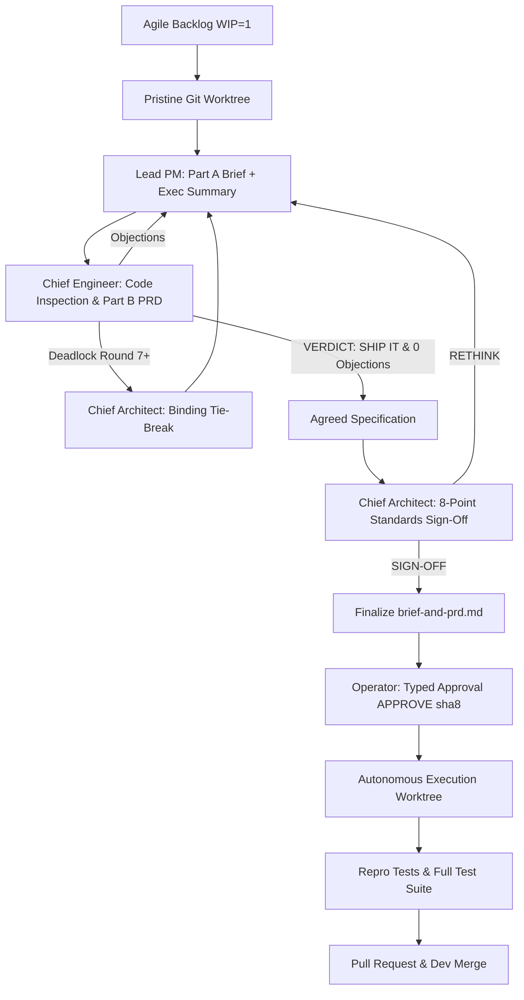

<div align="center">

# 🏛️ Open Councilmen

### *Autonomous, Multi-Agent Deliberation & Execution Council for Software Engineering*

[](https://github.com/goshtasb/OpenCouncilmen/actions)
[](https://opensource.org/licenses/MIT)
[](https://nodejs.org/)

**Stop micromanaging AI coding assistants. Let an adversarial council of specialists deliberate, verify, and execute your backlog — powered directly by your existing AI subscriptions.**

[Key Features](#-key-features) •
[The Council Positions](#-the-council-positions) •
[Subscription-First Engine](#-subscription-first-engine-zero-api-burn) •
[Live Retro Office](#-the-retro-pixel-office) •
[Quickstart](#-quickstart) •
[Architecture](#-architecture)

---

</div>

## 💡 Why Open Councilmen?

Single-agent AI coders hallucinate, accept ambiguous requirements, make silent breaking changes, and require constant human intervention.

**Open Councilmen** introduces an autonomous multi-agent separation of powers:
1. **The Council Lead & Principal PM** (*Synapse Archetype*): Enforces user value, jobs-to-be-done, scope boundaries, and drafts the human-readable Brief + Executive Summary.
2. **The Chief Engineer & Developer** (*Claude Code Archetype*): Owns technical ground truth. Challenges the PM with `file:line` citations, writes testable numbered PRDs, and executes code in clean git worktrees.
3. **The Chief Architect & Arbiter** (*Grok Archetype*): Zero-tool impartial judge. Provides binding rulings on deadlocked objections (`STANDS`, `OVERRULED`, `MEASURE`) and conducts architecture sign-offs against an 8-point industry standards checklist.
4. **The Executive Operator** (*You*): Reviews only the plain-language Executive Summary. One typed approval authorizes hands-off autonomous implementation and pull request creation.

---

## ⚡ Key Features

* **Adversarial Deliberation**: Rigorous multi-round debate between PM and Engineer until evidence compels convergence (`SHIP IT` + 0 open objections).
* **Binding Arbitration**: If consensus stalls, the Chief Architect arbitrates on principle.
* **8-Point Industry Standards Sign-off**: Every specification is formally checked for SOC2 separation of duties, OWASP security, regression testing, data privacy (GDPR/CCPA), ADR documentation, SRE resiliency, WCAG accessibility, and deterministic contracts.
* **Subscription-First (Zero API Token Burn)**: Works with your flat-rate subscriptions (Claude Pro/Max via `claude` CLI, Grok via `grok` CLI, Gemini Advanced, Copilot CLI, or local Ollama) rather than burning hundreds of dollars in per-token API fees.
* **Hands-Off Execution**: The Chief Engineer clones an isolated worktree, writes reproduction tests, fixes CI failures, and opens a clean GitHub Pull Request.
* **Retro Pixel-Art Office**: A live local HTML5 canvas dashboard showing animated councilmen typing at their desks, blinking monitors, and real-time kanban whiteboard.

---

## 👥 The Council Positions

| Seat | Archetype | Responsibilities | Boundaries |
| :--- | :--- | :--- | :--- |
| **Lead PM** | Synapse (Gemini / Claude / GPT) | Strategic framing, user journeys, Part A (Product Brief), Executive Summary. | Never edits code or invents technical mechanics. |
| **Chief Engineer** | Claude Code (`claude -p`) | Codebase verification, numbered Part B (PRD), repro tests, autonomous execution & PR merge. | Cannot ratify without measuring against active code. |
| **Chief Architect** | Grok (xAI) | Binding deadlock tie-breaker (`STANDS/OVERRULED/MEASURE`) and 8-point standards sign-off. | Zero repo tools; rules strictly on architectural principle. |
| **Executive Operator** | Human (You) | Executive sign-off (`APPROVE <sha8>`), business and design direction. | Never burdened with technical ambiguity. |

---

## 💳 Subscription-First Engine (Zero API Burn)

Deliberating whole PRDs and scanning large codebases can burn enormous API tokens. Open Councilmen was built subscription-first:

* **Claude Code Adapter**: Connects to the local `claude` CLI using your Claude Pro or Team subscription.
* **Grok Adapter**: Connects to `grok` CLI utilizing your X Premium / SuperGrok subscription.
* **Gemini Adapter**: Connects to Google AI or Gemini CLI.
* **Ollama Adapter**: Free, local, unlimited model execution (Llama 3, DeepSeek R1, Qwen).

Configure your seats in `.councilmen/config.yml`:

```yaml
seats:
  lead_pm:
    provider: "gemini-cli"
    model: "gemini-2.0-flash"

  chief_engineer:
    provider: "claude-code"
    model: "claude-3-7-sonnet"

  chief_architect:
    provider: "grok-cli"
    model: "grok-4"
```

---

## 🕹️ The Retro Pixel Office

Open Councilmen includes a built-in retro pixel-art office visualizer. Run:

```bash
councilmen office
```

Navigate to `http://localhost:4321` to watch your councilmen at work in real time:
* Councilmen sprite avatars type at their desks when busy and rest when idle.
* Monitors illuminate with active code and deliberation streams.
* Click the office whiteboard to view the live agile pipeline backlog (WIP=1).
* Real-time status ticker broadcasting session events.

---

## 🚀 Quickstart

### 1. Initialize in Your Repository
Inside any project (Node, Python, Go, Rust, Java, etc.):

```bash
npx open-councilmen init
```
This generates:
* `.councilmen/config.yml` — Project settings, test commands, model selection.
* `.councilmen/CONSTITUTION.md` — Project laws and architectural invariants.
* `.councilmen/DELEGATION.md` — Standing delegation rules.
* `.councilmen/personas/` — Prompt templates for your council seats.

### 2. Queue an Item on the Backlog
Open Councilmen enforces a strict **WIP=1** agile queue:

```bash
councilmen backlog add "Add Stripe webhook idempotency and audit logs" --priority 1
```

### 3. Deliberate & Approve
```bash
# Open deliberation session in a clean worktree
councilmen open stripe-webhook-idempotency

# Review & tie-break if needed
councilmen tiebreak <session-id>
councilmen review <session-id>

# Finalize agreed deliverable
councilmen finalize <session-id>

# Operator approves via typed token
councilmen approve <session-id> "APPROVE 8a3f1b9c"
```

### 4. Hands-Off Autonomous Execution
```bash
councilmen handoff <session-id>
councilmen run <session-id>
```
The Chief Engineer creates a feature branch (`council/<slug>`), writes reproduction tests, implements changes, verifies CI, and submits a ready Pull Request.

---

## 🏛️ Architecture



---

## 📄 License

Open Councilmen is open-sourced under the [MIT License](LICENSE).
